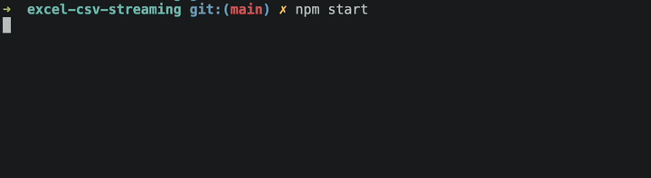

# File WriteStream

## Getting started

This project is a prove of concept for writing large datasets with a different types of files using streaming methods. Currently only these cases are covered:

- XLSX (Excel file)
- CSV
- Text (Plain Text)

## Setup

Clone this project to your local machine, and do the installation via:

> npm install

## Running The Example

In Typescript Version via `ts-node`
> npm start

In JS Version
> npm run build

> npm run start:js

## File Result

After running some example, check generated file at `files` directory according to the file type you've been choosing before (e.g. `.xlsx`, `.csv`, `.txt`).